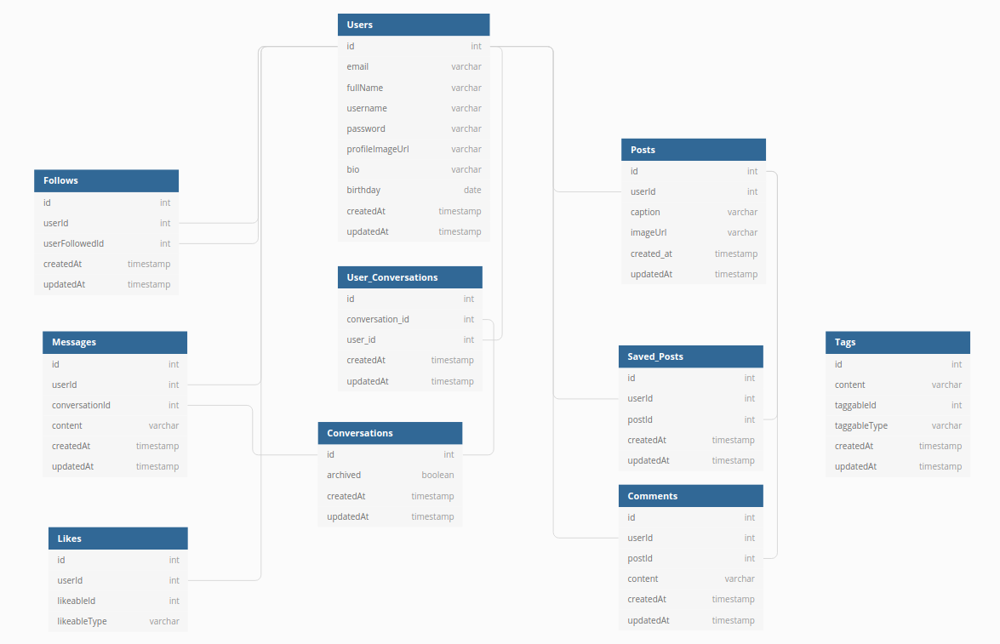

## Backend Schema

Below is a representation of all of the tables and their relations

1. Users: all user information
    * Follows.userId => Users.id
    * Follows.userFollowedId => Users.id
    * Messages.userId => Users.id
    * Messages.userMessagedId => Users.id
    * Likes.userId => Users.id
    * Posts.userId => Users.id
    * Saved.userId => Users.id
    * Comments.userId =>Users.id

2. Follows: Users following one another
    * Follows.userId => Users.id
    * Follows.userFollowedId => Users.id

3. Messages: Direct message conversations that users have joined'
    * Messages.userId => Users.id
    * Messages.conversation_id => Converstaions.id

4. Conversations: The channel in which users message each other
    * User_Conversations.conversation_id => Conversation.id
    * Messages.conversation_id => Converstaions.id

5. user_conversations: Many to many relationship between conversations and users
    * User_Conversations.user_id => Users.id
    * User_Conversations.conversation_id => Conversation.id

6. Likes: Polymorphic relationship for liking Posts/Comments
    * Likes.userId => Users.id
    * LikeableId => either Posts.id or Comments.id
    * LikeableType => either "post" or "comment"

7. Posts: All the posts in the app
    * Saved_Posts.postId => Posts.id
    * Comments.postId => Posts.id
    * Posts.userId => Users.id

8. Saved_Posts: Users saved posts
    * Saved_Posts.userId => Users.id
    * Saved_Posts.postId => Posts.id

9. Comments: Comments made on posts
    * Comments.userId => Users.id
    * Comments.postId => Posts.id

10. tags: Polymorphic relationship for tagging either with '#' for comments/posts and '@' for tagging users
    * Hashtags.taggableId => either Posts.id, Users.id, or Comments.id
    * Hashtags.taggableType => either "post" or "comment", or "user"
